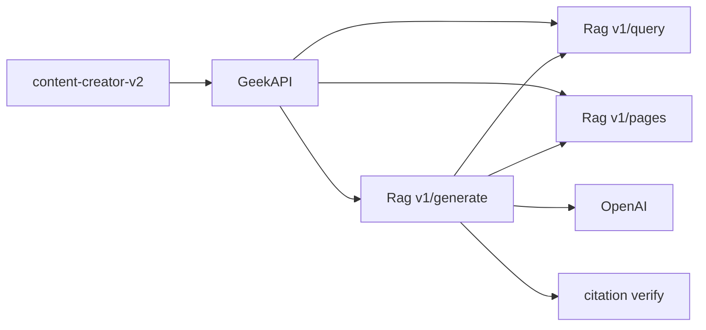

# Citeable Rag output (fix major misses)

Sibling repos: **Geek-Crawler-Rag** (producer), **GeekBackend** (proxy), **content-creator-v2** (display only).  
**Out of scope:** LlamaParse / any paid parse SaaS. Keep Readability→Markdown for crawl extract. Keep hybrid BM25 + GraphRAG as finders.

## Misses to fix

| Miss | Why it hurts | Fix |
|------|----------------|-----|
| **No page Markdown API** | Query returns chunk `text` only; `pageId` is in Qdrant but not on `ChunkHit`. Writers cannot open full Mongo Markdown to pick real quotes. | Rag: expose `pageId` on hits + `GET /v1/pages/{pageId}` (Markdown/title/url). |
| **GeekAPI one-shot generate** | Single `/v1/query` → one OpenAI complete; sources are URL+title only; no retrieve→read→verify. | Rag: `POST /v1/generate` (LlamaIndex Workflow / LlamaAgents). GeekAPI becomes thin proxy. |

Secondary: main creates research (`GccV2GeekCrawlerResearchResolver`) queries Rag **without** `preferParent` — same Phase 1 retrieval fixes apply.

## Ownership

| Layer | Role |
|-------|------|
| Geek-Crawler-Rag | Retrieval + page Markdown + agentic generate + citation verify |
| GeekAPI | Proxy `/api/rag/generate` → Rag; pass `preferParent` on CC research queries |
| content-creator-v2 | Display `citations[]` (quote + URL); no generate logic |



## Phase 1 — Page Markdown + citation-ready hits (Rag)

1. Add `pageId` to `ChunkHit` (payload already has it in Qdrant).
2. `GET /v1/pages/{pageId}` → `{ pageId, runId?, url, title, markdown }` from Mongo (`mongo.py`); 404 if missing/empty.
3. Optional: `GET /v1/pages?runId=&url=` lookup when only URL is known.
4. Writing retrieval: prefer parent/`sectionTitle`; raise `minQuality`/length for citation context; never use Readability `Excerpt` as evidence.
5. GeekAPI: `GccV2GeekCrawlerResearchResolver` pass `preferParent` for long-form research; map `pageId` into quoteables.

**Done when:** a client can query → get `pageId` → fetch full Markdown without re-crawling.

## Phase 2 — End one-shot: LlamaAgents generate in Rag

1. `POST /v1/generate` workflow: retrieve (hybrid; graph for slides) → **read page Markdown** for top-N → outline → draft (quotes only from tool output) → **verify** (URL ∈ set; quote ⊆ Markdown) → strip/flag failures.
2. Response includes `citations[{ pageId, url, title, sectionTitle, quote }]`, plus body/sources/themes/warnings.
3. Intent families mirror current GeekAPI writer (long-form / short / battlecard / slides). OpenAI in Rag (same model env pattern as today’s router).

**Done when:** drafts are not a single prompt over chunk paragraphs; every cite has a verified quote from Mongo Markdown.

## Phase 3 — GeekAPI thin proxy

1. `IGeekCrawlerRagClient.GenerateAsync` → Rag `/v1/generate`.
2. `RagGenerateService` stops local prompt+OpenAI when Rag generate is up; temporary fallback to one-shot with warning, then remove.
3. DTO: add `citations` with quotes through to Creator.

## Phase 4 — Creator display

1. `/rag` UI: show quote + link from `citations[]` (not title-only chips).
2. No agent UX required for this miss-fix (D4 UX can follow later).

## Non-goals

- LlamaParse / LlamaCloud
- Replacing hybrid or GraphRAG
- Hand-rolled agent loop in GeekAPI
- Replacing Readability for crawl HTML→Markdown

## Success criteria

- [x] Page Markdown fetchable by `pageId` from Rag (`GET /v1/pages/{pageId}`)
- [x] `ChunkHit` includes `pageId`
- [x] Generate is multi-step in Rag (`POST /v1/generate` LlamaIndex Workflow)
- [x] Citations include verified quotes from Markdown
- [x] Creator displays those quotes
- [ ] Ops: existing Mongo Markdown backfill + reindex (see below)

## Updating existing data

Code alone does not invent Markdown or refresh Qdrant payloads. Run these ops after deploy (Hostinger Rag + Mongo).

### 1. Markdown backfill (Mongo)

Pages crawled before Title/Markdown ingest still need body text:

```bash
# Coverage report (read-only)
uv run python scripts/markdown_coverage_report.py --limit-runs 20

# On Hostinger Rag container / host with MONGO URL
uv run python scripts/backfill_markdown.py --dry-run --limit 50
uv run python scripts/backfill_markdown.py --write
# Optional per run:
uv run python scripts/backfill_markdown.py --run-id <guid> --write
```

Then optional cleanup of unusable pages:

```bash
uv run python scripts/cleanup_unusable_pages.py --write
```

**Done when:** `crawl_pages` docs used for writing have non-empty `Markdown`.

### 2. Reindex affected runs (Qdrant)

`pageId` is already stored on points from parent/child index; **query now returns it** without reindex. Reindex **is** required when:

- Markdown was just backfilled (chunks were built from HTML or empty)
- Parent/child / quality payloads are stale

```bash
curl -X POST "$RAG_URL/v1/index" -H "X-Api-Key: $KEY" -H "Content-Type: application/json" \
  -d '{"runId":"<partner-or-competitor-run-guid>"}'
# Poll GET /v1/index/{runId} until state=complete
```

Reindex all recent complete partner + competitor runs for accounts that use `/rag` generate.

### 3. Deploy order

1. Deploy **Geek-Crawler-Rag** (pages + generate APIs)
2. Backfill Markdown → reindex runs
3. Deploy **GeekBackend** (proxy + preferParent research)
4. Deploy **content-creator-v2** (citations UI)

Env (optional):

| Var | Default | Meaning |
|-----|---------|---------|
| `GENERATE_ENABLED` (Rag) | true | Soft-disable Rag `/v1/generate` |
| `GEEK_RAG_CITEABLE_GENERATE_ENABLED` (GeekAPI) | true | Prefer Rag generate; false → old one-shot |
| `OPENAI_API_KEY` / `OPENAI_LONGFORM_MODEL` / `OPENAI_STANDARD_MODEL` | o3 / gpt-4o | Writer models on Rag |

### 4. Verify

- `GET /v1/pages/{pageId}` returns markdown for a known page
- `POST /v1/query` chunk includes `pageId`
- `POST /api/rag/generate` returns `citations[].quote` that match page Markdown
- Status shows `citeableGenerateAvailable: true`