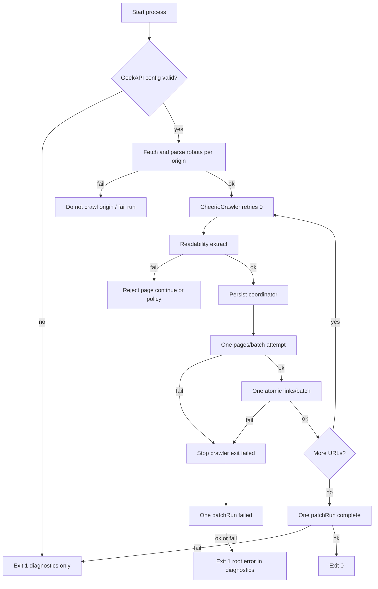

# Fail closed: one path, one attempt, one result

**Status: IMPLEMENTED (client/crawler) — GeekAPI atomic links + canonical schema must match server.**

## Controlling rule

Every required operation has **one** selected implementation, **one** request attempt, **one** response schema, and **one** terminal result: success or failure.

A failure **stops the affected run** and is never redirected, replayed, retried, substituted, locally persisted as authority, or converted into partial/degraded success.

This is **not** a “controlled-fallback” plan. Alternate execution paths, dual schemas, soft modes, mirrors, resume-after-fail, and client replay are out of policy.

Sibling law: [`.cursor/rules/no-retries-no-fallbacks.mdc`](.cursor/rules/no-retries-no-fallbacks.mdc) — interpreted strictly as above.

## Explicitly removed (former plan)

| Former item | Why removed |
|-------------|-------------|
| Cheerio → Playwright | Alternate renderer. **Selected: CheerioCrawler only.** |
| Readability → semantic DOM | Alternate extractor. **Selected: Readability only.** |
| Crawlee `maxRequestRetries` > 0 | Retry = second attempt. **Set to 0.** |
| Robots fail-open | Unknown policy ≠ permission. **Fail closed for that origin.** |
| `PERSIST_MODE=local` / dual modes | Two persistence implementations. **GeekAPI only.** |
| `KEEP_LOCAL_DATA` mirror / local failed stub | Secondary persistence when authority unavailable. **Removed.** |
| Resume after persistence failure | Second attempt at a failed run. **Forbidden.** Start a **new** run. |
| Client idempotent replay after commit-then-drop | Second client call. **Forbidden.** Server may keep idempotency as duplicate-delivery protection only; crawler never issues the second call. |
| `pages`/`Pages`, `count`/`Count` dual parse | Dual schemas. **One canonical schema.** |
| Partial link chunks accepted | Partial success. **One atomic links operation or links out of success contract.** |
| Suspense called “fallback” | Rename UI to **loading** placeholder; not a data-path exception. |

Sanitized upstream **502** stays as error presentation only — never paired with stale/local/partial success payloads.

---

## Selected single implementations

| Operation | One implementation |
|-----------|-------------------|
| Config | GeekAPI required at process/route startup; missing/invalid → fail startup / refuse serve |
| Render / fetch pipeline | **CheerioCrawler only** (Playwright pool deleted from product path) |
| Extract | **Readability only**; miss/throw → page reject, not a second extractor |
| Source fetch retries | **`maxRequestRetries: 0`** |
| Robots | Fetch+parse must succeed for the origin before any crawl of that origin; else origin blocked / run fails per § Robots |
| Persist | **GeekAPI only** — no local run/page/link authority, no mirror |
| Page ingest | Exactly one `pages/batch` HTTP attempt per required write |
| Link ingest | Exactly one atomic `links/batch` HTTP attempt per page’s links (see § Links) |
| Terminal run status | Exactly one `patchRun` attempt to mark `failed`/`complete`; if that fails → exit nonzero with **process diagnostics only** (no local surrogate record) |

Non-viable Cheerio HTML (SPA shell, challenge, empty): **reject that page** (or fail run if seed/origin policy requires) — do **not** switch renderers.

---

## Core runtime shape



---

## Persist coordinator (simplified)

Still required for concurrency:

1. Serialize all required GeekAPI writes.
2. First write failure is **terminal**: store root error, prevent any future outbound write, stop the crawler, exit failed.
3. **No** terminal-patch exception path that writes local stubs.
4. **No** recovery / resume / replay branch.
5. **No** “best-effort local failed record.”

**Invariant:** After the first observed persistence failure, no new outbound persistence request starts (including no second attempt of the failed call).

Deterministic barrier tests remain (two handlers; one failure; request count === 1).

---

## Idempotency (server-only)

- GeekAPI **may** accept/store an `Idempotency-Key` to defend against duplicate delivery at the infrastructure layer.
- The **crawler must not** rely on replay: timeout, connection drop, or ambiguous outcome → **fail the run**, do **not** issue a second HTTP call.
- Remove former “commit-then-drop → second call succeeds” client test. Replace with: “commit-then-drop → client fails run; mock insert count stays 1; client attempt count stays 1.”

---

## Response schema (canonical only)

Require **one** JSON shape (document exact field names in client + GeekAPI; no PascalCase alternate):

### `pages/batch` success

```json
{
  "pages": [{ "url": "https://...", "pageId": "..." }]
}
```

- `pages.length === submitted.length`
- each `pageId` non-empty string
- unknown/missing fields → fail run

### `links/batch` success

```json
{
  "count": 123
}
```

- `count` is number of link rows accepted for **this request**
- `count === submitted.length`
- no alternate `Count` field

### Links atomicity

- **Links are required** for accepting a page’s outbound graph in the success contract.
- Client sends **one** `links/batch` with all links for that page (no client chunking).
- If link count exceeds server max: **fail the run** (or fail before send) — do not split.
- GeekAPI must treat that request as **atomic** (all rows or error; no partial commit). Cross-repo requirement; until true, do not claim link success in product.
- Alternative only if product later drops links from the success contract entirely (explicit non-required) — not a silent partial.

---

## Robots (fail closed)

| Condition | Result |
|-----------|--------|
| DNS/TCP/TLS/timeout/5xx/empty/unparseable robots | **Do not crawl that origin** |
| 401/403 on robots | **Do not crawl that origin** |
| 404 | Treat as “no robots document” only if product policy defines that as allow-all **by explicit robots standard interpretation** — default for this plan: **still fail closed** unless RFC/product doc says 404 = empty allow; **locked: 404 = do not crawl** until product owner amends |
| Success parse | Enforce allow/deny rules; disallow → skip URL as reject, not a soft allow |

If the **seed origin** cannot get a successful robots fetch+parse → **fail the run** at start (no pages).

Event (diagnostics only): `robots_blocked` with origin + reason code — not a license to continue.

---

## Run state, exit, resume

| Topic | Decision |
|-------|----------|
| Authority | GeekAPI run record only |
| Success | One `patchRun(complete)` after crawl finishes with no persistence failure |
| Failure | Stop crawler; one `patchRun(failed)` attempt with bounded root message; if patch fails → **exit 1** with root error on **stderr/process diagnostics only** |
| Local JSON run stubs / page mirrors | **Removed** from success and failure authority paths |
| Crawlee `.crawlee` queue on disk | Engine scratch only; never reported as crawl success; purged/ignored on failed persist; **no operator resume of a failed run** |
| Resume APIs for failed runs | **Remove or hard-reject** (`409` / `ConfigError`: start a new run) |
| CLI exit | `0` only on authoritative complete; else `1` |
| Root error | Immutable on coordinator; shutdown noise must not replace it in diagnostics |

---

## Page extraction (single path)

- Readability only.
- Failure or empty article → **page extraction failure** (reject page). Not run-fatal by itself unless it’s the seed and policy says so (default: reject page, continue other URLs **only if** no persistence failure occurred).
- Bounded diagnostic: code, runId, url (≤2k), message (≤500). No HTML/stacks in GeekAPI payloads.

---

## Error taxonomy (still scoped; no soft substitutes)

| Type | Use |
|------|-----|
| `ConfigError` | Missing GeekAPI env, invalid startup |
| `PersistenceError` | Single ingest attempt failed / bad canonical ack / coordinator already failed |
| `RobotsBlockedError` | Origin robots unavailable or forbids seed |
| Page reject codes | extract empty, robots disallow URL, fetch fail with retries=0 |

No local surrogate converts these into success.

---

## Web BFF

- GeekAPI-only reads for run status/report when showing authoritative crawl data.
- Upstream failure → sanitized 502; **no** Crawlee/local substitute body.
- `CRAWLEE_API_URL` only for live crawl control plane (start/stop) if still used; must not be a second source of truth for completed run content.
- Auth: session required; no env token substitute.
- Protected routes independently 401; middleware refresh failure clears cookies (same attributes); integration test required.
- Suspense: **loading** UI placeholder only (rename away from “fallback” in comments/docs if present).

---

## Config boundaries

GeekAPI trio (`GEEK_API_URL`, `GEEK_BACKEND_API_KEY`, `GEEK_USER_ID`) required at:

- CLI `crawl` / `serve` startup
- Persist construction
- Web routes that read/write GeekAPI

Missing → fail startup or route with `ConfigError`. No `PERSIST_MODE`. No implicit local.

---

## Observability

Process diagnostics + optional GeekAPI host-progress only when the run still has authority. Codes include: `ROBOTS_BLOCKED`, `PAGE_EXTRACT_FAILED`, `PERSISTENCE_FAILED`, `STATUS_PATCH_FAILED` (patch failed after root persistence failure; exit still 1).

No event stream that implies degraded success.

---

## Implementation order

1. Update rule doc / this plan alignment; delete dual-mode and fallback language from README/`.env.example`.
2. GeekAPI client: single schema; single attempt; no retry/delay/replay; atomic links (no chunk loop); fail on timeout/malformed.
3. Persist coordinator: serialize; first failure terminal; remove local mirror/stub/resume-after-fail; remove `KEEP_LOCAL_DATA` / `PERSIST_MODE`.
4. Cheerio only: remove Playwright pool promotion; `maxRequestRetries: 0`.
5. Extract: Readability only; remove semantic DOM branch.
6. Robots: fail closed per origin/seed.
7. API: reject resume of failed runs; web: no local substitute; sanitized 502 only.
8. Auth/middleware/env cleanup.
9. Tests rewritten for one-attempt / no-replay / no-PW / robots blocked / no local stub.
10. CI tripwire for retries, dual schema, Playwright imports in product path, `PERSIST_MODE`, `KEEP_LOCAL_DATA`, link chunk loops.

---

## Verification checklist

- [ ] No Playwright product path; no semantic-DOM extract branch
- [ ] `maxRequestRetries === 0` on crawlers
- [ ] Robots failure blocks origin / fails seed run
- [ ] GeekAPI-only persist; no local authority records on failure
- [ ] One HTTP attempt per required ingest op; no client replay
- [ ] Canonical JSON only; no `Pages`/`Count` alternates
- [ ] No link chunking; atomic batch or fail
- [ ] No resume-after-persist-failure
- [ ] Coordinator: first failure terminal; deterministic concurrency test
- [ ] CLI exit 1 with diagnostics if status patch also fails
- [ ] Web never returns local/partial success for authoritative reads
- [ ] Unit + integration + typecheck + build green

## Strengthened tests

- Timeout on `pages/batch` → run failed; attempts === 1; no second call
- Malformed canonical ack → fail (not dual-schema parse success)
- Links over max → fail without splitting
- Two handlers: one persist fail → one HTTP total
- Non-viable HTML → reject, not Playwright
- Readability miss → reject, not semantic DOM
- Robots timeout on seed → run fail, zero pages written
- Resume failed run → rejected
- Protected route after refresh fail → 401
